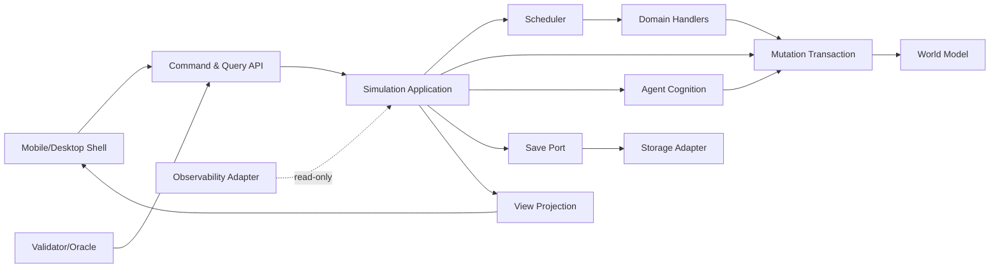

# Kiến trúc đa nền tảng và ranh giới module — K3.1

Tài liệu này chuyển các hợp đồng trong [[TU_DIEN_DU_LIEU_HOP_DONG_TRANG_THAI_K2]], [[HOP_DONG_LAP_LICH_XU_LY_SU_KIEN_K2]], [[HOP_DONG_GIAO_DICH_QUYEN_BAO_TOAN_K2]], [[HOP_DONG_NHAN_THUC_QUYET_DINH_TAC_NHAN_K2]], [[HOP_DONG_LUU_TAI_MIGRATION_PHUC_HOI_K2]], [[KE_HOACH_VALIDATOR_ORACLE_K2]] và [[NGAN_SACH_HIEU_NANG_QUY_MO_K2]] thành kiến trúc logic có thể triển khai cho điện thoại và máy tính.

Đây là **đề xuất kiến trúc**, chưa chọn ngôn ngữ, framework, cơ sở dữ liệu hoặc dịch vụ đồng bộ. Các tên module là trách nhiệm logic, không phải tên thư mục bắt buộc. 60 điều kiện KT ở cuối chỉ là đặc tả chưa chạy.

## 1. Mục tiêu của K3.1

Kiến trúc phải cho phép:

1. một lõi mô phỏng dùng chung tạo cùng kết quả trên mobile và desktop;
2. thế giới chạy theo event/boundary ở nhịp mục tiêu 5 giây thật bằng 1 ngày game;
3. UI luôn phản hồi và có thể yêu cầu dừng mà không cắt nửa giao dịch;
4. NPC chỉ quyết định từ điều chúng nhận biết;
5. save/load giữ đủ queue, RNG, tiến trình và nguồn gốc;
6. module nội dung mở rộng lâu dài mà không phá lõi;
7. validator, oracle và benchmark quan sát nhưng không can thiệp;
8. thay adapter nền tảng không đổi state logic.

## 2. Phạm vi và điều chưa làm

K3.1 xác định dependency graph, process/thread/storage boundary, ports, trách nhiệm module, lifecycle và tiêu chí so hướng công nghệ. K3.1 không:

- chốt stack;
- tạo source code hoặc schema máy;
- chứng minh 684 điều kiện cũ hay 60 điều kiện mới;
- cam kết cloud sync;
- chốt TN01–TN08;
- tuyên bố đạt ngân sách W1–W4.

## 3. Các lực kéo kiến trúc

| Lực kéo | Hệ quả bắt buộc |
|---|---|
| mô phỏng cực sâu | domain tách module nhưng dùng chung mutation kernel |
| 5 giây/ngày | event-driven, process integration, slicing và backpressure |
| NPC như người thật | CognitiveView riêng, lịch sử/niềm tin có nguồn |
| mobile + desktop | core portable, shell/adapters riêng, format save chung |
| thế giới lâu dài | id/version/migration/journal và compact có kiểm chứng |
| vô số vật/công pháp | data-driven definitions, feature guard, content version |
| text game | projection/query tối ưu cho thông tin, không gắn simulation vào layout |
| kiểm chứng sâu | ports cho runner/oracle/evidence ngay từ kiến trúc |

## 4. Mười sáu bất biến kiến trúc

1. Chỉ Simulation Core được quyền yêu cầu mutation gameplay.
2. Mỗi loại state có đúng một chủ quản ghi.
3. UI không giữ bản state có quyền ghi.
4. Platform clock không phải game clock.
5. Thứ tự collection, thread hoặc callback không phân định kết quả.
6. Số worker không đổi state hash.
7. Save chỉ chụp boundary hợp lệ hoặc frontier đầy đủ được version hóa.
8. View, log, metric và cache không tiêu RNG gameplay.
9. NPC planner không đọc WorldAuditView.
10. Domain handler không ghi thẳng storage.
11. Adapter không tự sửa hoặc bịa dữ liệu để phục hồi.
12. Unsupported content phải bị chặn rõ.
13. Mobile và desktop đọc cùng semantic projection.
14. Lệnh gửi lại giữ idempotency.
15. Mọi tối ưu R0–R4 phải giữ error budget đã công bố.
16. Core không phụ thuộc UI toolkit, OS API, cloud SDK hoặc filesystem cụ thể.

## 5. Bốn lớp trách nhiệm

| Lớp | Trách nhiệm | Được phụ thuộc vào |
|---|---|---|
| `Domain Model` | kiểu, quy tắc thuần, bất biến | thư viện nền tối thiểu |
| `Simulation Application` | scheduler, command, transaction, cognition, use case | Domain Model và ports |
| `Adapters` | storage, clock, compression, UI projection transport | ports + kiểu chia sẻ |
| `Platform Shell` | lifecycle, input, render, file picker, notification | Adapters/public API |

Dependency luôn hướng vào lõi. Lõi chỉ biết interface/port, không biết adapter cụ thể.

## 6. Dependency graph chuẩn



Mũi tên thể hiện quyền gọi/đọc hợp lệ, không nhất thiết là package import trực tiếp.

## 7. Các cấm phụ thuộc

- `World Model` không import scheduler, UI hoặc storage.
- Domain body/item/cultivation/combat không gọi nhau để ghi state; chúng lập `MutationIntent` qua transaction.
- Cognition không đọc repository toàn tri; nó nhận `CognitiveView`.
- Projection không tạo Command ngầm.
- Save adapter không gọi handler gameplay khi deserialize.
- Oracle không dùng cùng hàm implementation để tự tạo expected result khi cần độc lập.
- Platform shell không nắm khóa transaction.

## 8. Topology tiến trình đề xuất mặc định

Một phiên chơi có một **Simulation Runtime** có quyền sở hữu world sống. UI shell có thể cùng process hoặc khác process tùy nền tảng, nhưng giao tiếp qua cùng contract.

Topology logic:

```text
Platform Shell
  -> Command/Query Gateway
  -> Simulation Runtime (một authority)
       -> World Store trong bộ nhớ
       -> Scheduler + Transaction + Domains
       -> Snapshot/Journal Port
  <- ViewDelta / CommandReceipt / LifecycleStatus
```

Không cho hai runtime cùng ghi một world lineage. Nếu sau này có worker phụ, worker chỉ tính kết quả thuần từ input đóng băng; authority kiểm tra và commit theo canonical order.

## 9. Ranh giới thread

Đề xuất baseline dễ chứng minh là một logical simulation thread/actor:

- nhận Command vào inbox;
- xử slice tới boundary;
- commit mutation tuần tự theo canonical order;
- xuất immutable projection/delta;
- yield về shell;
- staging save qua dữ liệu bất biến.

Render/input/storage I/O có thể ở thread khác. Không được để callback I/O ghi World Store. Parallelism domain chỉ thêm sau khi có conflict set và parity evidence.

## 10. Ranh giới thời gian

`MonotonicClockPort` chỉ đo thời gian thật cho pacing và metric. `GameClock` thuộc state, chỉ tiến bởi scheduler sau commit hợp lệ.

Shell cung cấp:

- monotonic timestamp;
- lifecycle signal;
- requested pacing mode;
- time budget của WorkSlice.

Shell không gửi “hãy đặt ngày game thành X”. Thay đổi hợp lệ đi qua Command có policy/quyền tương ứng.

## 11. Simulation Runtime

Runtime phối hợp nhưng không chứa luật domain cụ thể. Trạng thái điều phối tối thiểu:

- world/branch/generation đang mở;
- current game time, phase và wave;
- command inbox cursor;
- scheduler frontier;
- transaction/idempotency registry;
- RNG stream registry;
- dirty revision ranges;
- projection subscriptions;
- lifecycle mode: STARTING, PAUSED, RUNNING, SAVING, STOPPING, FAILED_SAFE.

Runtime chỉ công bố View/Receipt sau khi state liên quan đã commit.

## 12. World Model

`world-model` sở hữu kiểu record, typed id, unit, revision và read/write set API. Nó không quyết định hành vi.

API logic chia ba mặt:

| Mặt | Người dùng | Quyền |
|---|---|---|
| `WorldReadSnapshot` | handler/transaction | đọc revision cố định |
| `WorldMutationSet` | transaction kernel | commit nguyên tử |
| `WorldAuditView` | validator/debug có quyền | đọc đầy đủ, không đưa cho NPC/UI thường |

Repository/index chỉ là cách truy xuất; record canonical mới là nguồn thật.

## 13. Scheduler

`scheduler` sở hữu event queue, recurrence, process frontier, phase/wave và wakeup. Nó gọi handler qua `DomainDispatchPort`, nhận intent/result rồi giao transaction commit.

Scheduler không:

- sửa vật phẩm/cơ thể trực tiếp;
- suy đoán mục tiêu NPC;
- gọi UI;
- đợi I/O trong atomic group;
- dùng wall-clock làm tie-break.

Output của một slice gồm committed boundary, phần game-time còn nợ, view invalidation keys và lý do yield.

## 14. Mutation Transaction

`mutation-transaction` là cửa ghi duy nhất. Pipeline:

1. nhận `TransactionPlan`/`MutationIntent`;
2. kiểm tra revision/read set;
3. kiểm tra physical feasibility;
4. kiểm tra operational authorization;
5. ghi nhận normative outcome;
6. reserve nếu nhiều bước;
7. kiểm tra conservation/source/sink;
8. commit toàn bộ hoặc không gì;
9. phát canonical facts/receipts;
10. cập nhật idempotency registry.

Normative violation có thể vẫn commit hành vi vật lý nếu policy cho phép, kèm hậu quả; nó không bị đồng nhất với mutation bất khả thi.

## 15. Domain modules

Domain chia theo chủ quản luật, không theo màn hình:

- `domain-body` — bộ phận, chức năng, thương tích, sinh lý;
- `domain-item` — vật thể, lô, cấu tạo, chất lượng, chế tác;
- `domain-cultivation` — linh lực, kinh mạch, công pháp, đột phá;
- `domain-combat` — tiếp xúc, đòn, phòng thủ, hậu quả;
- `domain-economy` — giá, việc, hợp đồng, nghĩa vụ;
- `domain-society` — hộ, thể chế, danh dự, thừa kế;
- `domain-environment` — nơi, tuyến, thời tiết, sinh thái, linh khí.

Một sự kiện xuyên hệ do orchestrator tạo plan gồm nhiều intent; không cho module A sửa bảng của module B qua đường tắt.

## 16. Agent Cognition

`agent-cognition` nhận Signal/Observation/Message cùng `CognitiveView`, cập nhật Belief/Memory/Appraisal/Goal/Decision qua các bước có nguồn. Action cuối chỉ là request; transaction/scheduler mới quyết state thật.

Module có hai port tách biệt:

- `PerceptionInputPort`: dữ liệu một tác nhân được phép nhận;
- `ActionRequestPort`: yêu cầu có actor, nguồn quyết định, giới hạn và idempotency key.

Policy P00 thuộc cấu hình phiên/fixture. PLAYER_DIRECT, CHARACTER hoặc HYBRID dùng cùng ports; K3.1 chưa chọn TN03.

## 17. Content và fixture

`content-fixture` nạp definitions, base, overlay, policy và feature guard. Content được xem là input có version, không là mã có quyền tùy ý.

Loader phải kiểm:

- schema/version;
- id/ref/unit;
- dependency và chu kỳ;
- base hash/overlay target;
- feature được runtime hỗ trợ;
- migration path;
- content fingerprint.

Tên/câu văn có thể địa phương hóa; id và semantics không phụ thuộc ngôn ngữ hiển thị.

## 18. Command Gateway

Mọi hành động từ người chơi hoặc công cụ quản trị đi qua gateway. `CommandEnvelope` tối thiểu có:

| Trường | Ý nghĩa |
|---|---|
| `command_id` | idempotency xuyên retry |
| `session_id` | phiên gửi, không là world authority |
| `actor_ref` | nhân vật/phạm vi tác động |
| `issued_at_revision` | state UI đã thấy khi tạo lệnh |
| `kind`, `payload_version`, `payload` | ý định có kiểu |
| `constraints` | giới hạn tiền, vật, thời gian, quyền |
| `client_sequence` | sắp phản hồi UI, không quyết gameplay |
| `requested_pause_mode` | đề nghị lifecycle nếu có |

Gateway validate cấu trúc và quyền gọi; runtime validate trạng thái thật tại boundary.

## 19. Vòng đời Command

Trạng thái chuẩn:

`DRAFT_UI -> SUBMITTED -> ACKNOWLEDGED -> ACCEPTED/REJECTED -> SCHEDULED -> APPLIED/CANCELLED/EXPIRED`.

ACK chỉ xác nhận đã nhận bền vững theo policy, không nói gameplay đã đổi. Receipt phải nêu revision/boundary và lý do công khai hợp lệ. Retry cùng `command_id` trả kết quả cũ hoặc tiếp tục cùng tiến trình, không nhân mục tiêu.

## 20. Event ports

Phân biệt bốn dòng:

1. `ScheduledEvent`: việc lõi phải xử tại game time/phase;
2. `DomainFact`: kết quả đã commit;
3. `ObservationCandidate`: fact có thể được tác nhân cảm nhận;
4. `ViewDelta`: thay đổi thông tin trình bày cho UI.

Không dùng một “event bus” chung rồi cho mọi subscriber sửa state. Chỉ scheduler/transaction authority tạo thay đổi canonical; các dòng còn lại có schema và quyền riêng.

## 21. Query và ViewProjection

UI không query bảng thô. `view-command` nhận `ViewRequest` gồm viewer, projection kind, cursor, locale và known revision; trả immutable `ViewSnapshot` hoặc `ViewDelta`.

Projection phải:

- lọc theo tri thức/quyền của viewer;
- giữ nguồn và thời điểm khi cần;
- đánh dấu stale/unknown;
- phân trang danh sách dài;
- ổn định key để mobile/desktop giữ vị trí đọc;
- không tiết lộ id bí mật qua tìm kiếm/error;
- không tạo observation mới chỉ vì mở trang.

## 22. Semantic UI contract

Mobile và desktop nhận cùng meaning:

- cùng mục tiêu, hạn, trạng thái, nguồn và lệnh hợp lệ;
- khác layout, mật độ, shortcut và số panel;
- action availability dựa trên capability/projection, không dựa kích thước màn hình;
- text quan trọng không chỉ biểu đạt bằng màu;
- focus/back/history thuộc shell, không thuộc world state.

Desktop có thể mở nhiều projection đồng thời; mobile dùng một cột và drill-down. Hai bên không được có quyền gameplay khác nếu cùng policy.

## 23. Platform Shell

Shell chịu trách nhiệm:

- app/window lifecycle;
- touch, keyboard, mouse và accessibility bridge;
- render/layout/navigation;
- monotonic clock và WorkSlice scheduling;
- storage location/permission/file picker;
- background restriction signal;
- notification cục bộ nếu policy cho phép;
- crash report/metric consent ở tầng sản phẩm sau này.

Shell không deserialize trực tiếp thành object domain có quyền ghi; nó gọi Load/Import port.

## 24. Mobile lifecycle

Các signal tối thiểu: FOREGROUND, INACTIVE, BACKGROUND_REQUESTED, MEMORY_PRESSURE, TERMINATE_HINT và RESUME.

Khi xuống nền:

1. shell ngừng cấp slice mới;
2. runtime khép atomic group hiện tại;
3. dừng tại safe boundary;
4. tạo lifecycle checkpoint nếu ngân sách cho phép;
5. publish manifest nguyên tử;
6. trả trạng thái đã an toàn hoặc lý do chưa xong.

Nếu OS giết app trước publish, lần mở sau phục hồi snapshot/journal đã công bố gần nhất. Không giả đã save khi mới staging.

## 25. Desktop lifecycle

Đóng cửa sổ, sleep, shutdown và crash được quy về cùng lifecycle protocol, nhưng desktop có thể có thời gian chuẩn bị dài hơn. Nhiều cửa sổ chỉ là nhiều view của một runtime; không mở runtime ghi thứ hai cho cùng slot.

Nếu người dùng mở hai tiến trình vào cùng save, lock/lease adapter phải từ chối người ghi sau hoặc mở read-only rõ ràng. Không auto-merge hai dòng thời gian.

## 26. Pause, resume và tốc độ

Pause request đi qua runtime control port, có receipt `REQUESTED`, `WAITING_ATOMIC`, `PAUSED_AT_BOUNDARY` hoặc `FAILED_SAFE`. UI có thể phản hồi ngay nhưng chỉ hiển thị “đã dừng” sau boundary.

Tốc độ 5 giây/ngày là pacing target. Khi quá tải, runtime báo lag và tiến ít game-time hơn; shell không bỏ event để giữ đồng hồ. TN01 vẫn quyết định auto-pause policy cụ thể.

## 27. Offline policy

Kiến trúc giữ hai adapter policy:

- `OFFLINE_STOP`: world không tiến khi runtime đóng;
- `OFFLINE_CATCHUP`: khi mở, tạo kế hoạch catch-up từ elapsed wall time đã xác thực theo policy.

CATCHUP vẫn chạy scheduler và transaction, không nhảy thẳng state cuối. Nếu quá lớn, chia đoạn, cho dừng và báo tiến độ. Chọn policy phụ thuộc TN02, không được platform tự quyết.

## 28. Save architecture

`save-migration` tách nghĩa logic khỏi storage:

- `SnapshotBuilder` lấy frozen boundary image;
- `JournalWriter` ghi entry có sequence/hash;
- `ManifestPublisher` công bố generation theo hai pha;
- `LoadPipeline` kiểm manifest, version, checksum, refs và invariants;
- `MigrationRunner` đổi dữ liệu theo graph có bằng chứng;
- `RecoveryPlanner` chỉ chọn state đã chứng minh.

Serialization canonical phải giống giữa nền tảng. Nén, mã hóa và filesystem là adapter; chúng không đổi hash logic trước lớp đóng gói.

## 29. Storage ports

Các port tối thiểu:

| Port | Khả năng |
|---|---|
| `AtomicBlobStore` | stage, fsync-equivalent nếu có, publish, list, read |
| `SaveLeaseStore` | khóa/lease một writer |
| `CheckpointRetentionStore` | pin, prune theo policy |
| `ContentStore` | đọc package bất biến theo fingerprint |
| `EvidenceStore` | ghi artifact kiểm thử/benchmark ngoài save gameplay |

Adapter phải công bố capability thật. Nền tảng không có atomic rename cần protocol manifest phù hợp; không giả semantics desktop.

## 30. Import, export và portability

Save export là package có manifest, format version, world lineage, generation, content fingerprints, checksums và payload. Import luôn staging vào slot/branch mới trước khi validate; không ghi đè slot sống trong lúc kiểm.

Path, line ending, locale, endian và timestamp representation không được ảnh hưởng logic. Unsupported version/content trả chẩn đoán, không tự bỏ record lạ.

## 31. Đồng bộ đa thiết bị như extension

U011 không tự bao gồm cloud sync. Kiến trúc chỉ chừa `ReplicaTransportPort` sau lớp save:

- truyền immutable generation/package;
- so lineage/ancestor/generation/hash;
- fast-forward khi một nhánh là hậu duệ rõ;
- báo divergence khi hai phía cùng tiến;
- người dùng chọn nhánh hoặc tạo bản sao;
- không trộn event/state tự động.

Core vẫn chạy hoàn toàn cục bộ khi port không tồn tại.

## 32. Validator và Oracle

`validation-oracle` có hai chế độ:

- in-process read-only cho static/runtime monitor nhẹ;
- external runner dùng public command/load/export API.

Oracle không nhận write capability. Fault injection chỉ dùng adapter/runtime test được đánh dấu, không có trong save phát hành. Evidence gắn build, schema, content, seed, device, policy và start/end hash.

## 33. Observability

Metric/log/trace nhận bản ghi sau commit hoặc immutable diagnostic snapshot. Mỗi record có monotonic time, game time, phase, correlation/causal id và severity.

Quy tắc:

- metric sink chậm được drop metric, không drop gameplay;
- log text không là nguồn phục hồi;
- profiler bật/tắt không đổi seed/order;
- dữ liệu nhạy cảm hoặc bí mật gameplay không đi vào UI log thường;
- benchmark build ghi rõ mức instrumentation.

## 34. Cache và index

Cache/index được phân loại:

| Loại | Ví dụ | Phục hồi |
|---|---|---|
| derived ephemeral | tìm người gần, tổng tải hiển thị | bỏ và dựng lại |
| derived persisted | index lớn để load nhanh | checksum + rebuild từ canonical |
| canonical | record/event/journal | không được gọi là cache |

Eviction không được thay kết quả. Query planner có thể khác giữa thiết bị nhưng output semantic/canonical ordering phải như nhau.

## 35. Concurrency và parallelism

Baseline là deterministic single-writer. Hướng mở rộng an toàn theo thứ tự:

1. I/O save từ frozen image;
2. projection read từ immutable revision;
3. pure calculation trên partition có declared read/write set;
4. authority sort và validate kết quả;
5. commit tuần tự;
6. so parity với baseline.

Không parallelize cognition/transaction tùy ý chỉ để đạt W4. Conflict, cancellation và stale result phải có semantics trước.

## 36. R0–R4 trong kiến trúc

Resolution handler là strategy nằm sau cùng domain port. `ResolutionPlan` thuộc state/policy, không thuộc device adapter. Promotion/demotion tạo event có nguồn và cắt interval ở deadline/threshold.

Core baseline chi tiết hơn là oracle tham chiếu cho mẫu nhỏ. Handler tổng hợp chỉ được bật cho loại đã có parity/error-budget evidence. Thiết bị chậm phát backpressure, không tự hạ R-level.

## 37. Error handling và trạng thái an toàn

Lỗi chia:

- `REJECTED_INPUT`: command/content sai, world không đổi;
- `CONFLICT_RETRYABLE`: revision/lease/stale, có thể thử lại có kiểm soát;
- `UNSUPPORTED`: feature/version chưa có;
- `CORRUPT_DATA`: load dừng trước READY;
- `INVARIANT_BREACH`: runtime dừng tại FAILED_SAFE, giữ artifact;
- `RESOURCE_PRESSURE`: yield/checkpoint/backpressure;
- `PLATFORM_FAILURE`: adapter thất bại, core không giả thành công.

FAILED_SAFE cấm tiếp tục mutation cho tới khi recovery/reload hợp lệ.

## 38. Phiên bản và compatibility

Version độc lập cho:

- record schema;
- command/event payload;
- content/ruleset/policy;
- save container;
- RNG algorithm/stream map;
- projection API;
- condition/oracle;
- platform adapter capability.

Không dùng một số “game version” duy nhất để suy ra mọi compatibility. Migration chỉ đổi loại đã khai báo và ghi provenance.

## 39. Modding và nội dung tương lai

Kiến trúc data-driven giúp thêm vật phẩm/công pháp/NPC, nhưng K3.1 chưa cam kết mod code tùy ý. Giai đoạn đầu nên coi content package là dữ liệu khai báo qua schema và expression DSL giới hạn.

Nếu có script sau này, nó cần sandbox, deterministic API, budget, version và save compatibility. Script không được gọi OS/network/wall-clock hoặc tạo RNG ngoài registry.

## 40. Ranh giới bảo mật và dữ liệu không tin cậy

Save nhập, content ngoài và tên người dùng đều là input không tin cậy. Loader giới hạn kích thước, độ sâu, số record/ref, chuỗi và tài nguyên giải nén; lỗi không thực thi payload.

Đây là ràng buộc kỹ thuật cho portability/modding, không biến game chơi đơn thành dịch vụ bắt buộc đăng nhập. Secret/token của cloud extension, nếu có, nằm ở platform secure storage và không vào save.

## 41. Khả năng tiếp cận và phương thức nhập

Command semantics không gắn vào gesture. Shell ánh xạ touch, keyboard, mouse hoặc assistive action thành cùng UI intent rồi cùng Command.

Projection hỗ trợ:

- heading/label/focus order;
- font scale/reflow;
- nội dung trạng thái bằng chữ;
- giảm chuyển động nếu có;
- shortcut có thể đổi;
- xác nhận chỉ cho hành động hậu quả lớn theo policy.

Các lựa chọn này không đổi simulation hash.

## 42. Build và cấu hình phát hành

Đề xuất tách artifact logic:

- `core-runtime` dùng chung;
- `content-pack` có fingerprint;
- `mobile-shell`;
- `desktop-shell`;
- `validation-runner`;
- `benchmark-runner`;
- `migration-tool`.

Debug capability không được âm thầm có trong UI phát hành. Cùng core/content revision phải được truy nguyên giữa build mobile và desktop.

## 43. Tiêu chí so hướng công nghệ

Mỗi stack ứng viên phải có bằng chứng/prototype nhỏ cho 12 tiêu chí:

1. một codebase core chạy mobile/desktop;
2. integer/fixed-point và serialization canonical;
3. deterministic RNG/order;
4. thread/lifecycle/background control;
5. atomic storage và file portability;
6. UI text dài, bảng, tìm kiếm, accessibility;
7. memory/GC/pause ở W1;
8. tooling schema/test/fuzz/profile;
9. migration và backwards compatibility;
10. build/package/update trên hai nền tảng;
11. khả năng thuê người/bảo trì hệ sinh thái;
12. đường mở W2–W4 mà không thay semantic core.

Không chọn theo mức quen tay hoặc benchmark vi mô duy nhất.

## 44. Ba họ kiến trúc cần so ở K3.2

| Họ | Mô tả | Điểm cần chứng minh |
|---|---|---|
| A — core native portable + shell riêng/chung | lõi biên dịch đa nền tảng, UI gọi API | FFI/build complexity, parity, tooling |
| B — runtime web/hybrid cục bộ | core và UI trong web runtime/container | background, storage, memory, integer/perf |
| C — framework/app đa nền tảng với core thuần | một framework UI, core tách package | lifecycle, native storage, deterministic core |

Game engine đồ họa chỉ là một biến thể nếu chứng minh text/accessibility/lifecycle tốt; không mặc định có lợi cho game này. K3.1 không xếp hạng hay chọn họ thắng.

## 45. Prototype quyết định công nghệ

Mỗi ứng viên phải làm cùng một spike bỏ đi:

- load fixture W0;
- chạy scheduler/transaction cố định;
- gửi Command và nhận ViewDelta;
- pause tại boundary;
- save, kill giữa publish, recovery;
- xuất canonical state hash;
- chạy trên ít nhất một mobile và một desktop;
- đo input/view/save/memory;
- so byte/hash và event trace.

Prototype chỉ đánh giá kiến trúc; không phát triển gameplay riêng cho từng ứng viên.

## 46. Ma trận quyết định chưa chấm điểm

| Nhóm | Trọng số đề xuất | Điều kiện loại trực tiếp |
|---|---:|---|
| correctness/parity | 25% | không tạo cùng canonical hash |
| lifecycle/save | 15% | không phục hồi an toàn khi bị kill |
| hiệu năng W1 | 15% | không có đường đo/đáp ứng hợp lý |
| UI text/accessibility | 15% | text dài hoặc input không dùng được |
| maintainability/tooling | 15% | core bị khóa vào UI/platform |
| distribution/portability | 10% | save/build không di chuyển được |
| ecosystem/risk | 5% | phụ thuộc bỏ hoang hoặc license không phù hợp |

Trọng số là đề xuất kỹ thuật và có thể đổi trước K3.2. Điều kiện loại xuất phát từ bất biến nên quan trọng hơn tổng điểm đẹp.

## 47. Các kiểu kiến trúc phải tránh

- UI component sửa object world trực tiếp.
- Mỗi nền tảng có một bản simulation riêng.
- Một event bus toàn cục không quyền/chủ quản.
- Mỗi NPC là OS thread/process.
- Poll mọi NPC mỗi tick dù không có wakeup.
- ORM/database row trở thành domain model và transaction semantics ngầm.
- Save bằng dump object graph phụ thuộc runtime.
- Cloud là source duy nhất cho game chơi đơn.
- Dùng frame/render loop làm game clock.
- Tối ưu bằng bỏ event trên thiết bị yếu.

## 48. Architecture Decision Record

Mỗi quyết định K3 sau này nên có:

- vấn đề và ràng buộc;
- các phương án thực sự đã so;
- evidence/prototype fingerprint;
- quyết định và ngày/trạng thái;
- hệ quả tốt/xấu;
- điều kiện xem xét lại;
- liên kết tới TN hoặc yêu cầu người dùng liên quan.

Đề xuất của tài liệu không tự trở thành ADR `ACCEPTED` khi người dùng chỉ nói “tiếp”.

## 49. Lát cắt triển khai đầu tiên khi được phép code

Vertical slice nhỏ nhất nên đi xuyên kiến trúc:

1. WorldManifest + vài record V01/V02/P00;
2. một Command giao mục tiêu;
3. scheduler xử một boundary;
4. một transaction chuyển lượng bảo toàn;
5. một observation/belief tối thiểu;
6. ViewProjection cho trạng thái và nhật ký;
7. boundary save/load;
8. state hash và oracle;
9. cùng scenario trên mobile/desktop shell thử nghiệm.

Lát cắt không cần toàn bộ cơ thể/công pháp nhưng phải dùng đúng ports cuối cùng, tránh demo đi đường tắt.

## 50. Thứ tự hiện thực hóa kiến trúc đề xuất

1. frozen contracts và package dependency checks;
2. typed core records/canonical codec;
3. runtime single-writer + command inbox;
4. scheduler W0;
5. transaction/conservation W0;
6. projection semantic tối thiểu;
7. save/journal/load/recovery;
8. validator/oracle/evidence;
9. shell desktop và mobile mỏng;
10. cognition/domain lát cắt An Khê;
11. W1 correctness/parity;
12. W1 benchmark;
13. chỉ sau đó parallel/R0–R4/W2+.

## 51. Rủi ro và biện pháp kiến trúc

| Rủi ro | Dấu hiệu sớm | Biện pháp |
|---|---|---|
| state kép | cùng quantity ở domain và UI/store | owner matrix + write port duy nhất |
| nondeterminism | hash đổi theo run/worker | canonical order + trace diff |
| truth leak | NPC biết vật/nơi chưa thấy | CognitiveView capability tests |
| UI coupling | đổi layout làm test simulation hỏng | semantic projection contract |
| save lệch nền tảng | import khác hash | canonical codec + golden cross-run |
| mobile bị kill | slot báo save nhưng không load | two-phase publish + fault injection |
| event storm | UI treo/queue tăng vô hạn | slicing, causal guard, backpressure |
| abstraction quá sớm | quá nhiều interface không scenario | vertical slice buộc port có người dùng thật |
| content phá save | đổi definition làm record vô nghĩa | fingerprint/compatibility/migration |
| W4 dẫn dắt sai | phá correctness để benchmark đẹp | W1 gates trước scale work |

## 52. Các quyết định chưa cần người dùng trả lời ngay

- ngôn ngữ/framework cụ thể;
- một hay nhiều process vật lý;
- codec/hash/compression cụ thể;
- database hay file package;
- UI toolkit;
- worker pool;
- cloud provider;
- mod scripting.

K3.2 có thể thu thập bằng chứng trước. TN01–TN08 chỉ cần hỏi khi prototype/architecture thật sự rẽ nhánh hoặc trước khi chốt trải nghiệm.

## 53. Các cổng sẵn sàng triển khai

| Gate | Yêu cầu | Hiện tại |
|---|---|---|
| K3G01 | module owner và dependency direction rõ | đạt trên giấy |
| K3G02 | command/event/query/save ports rõ | đạt trên giấy |
| K3G03 | process/thread/storage boundary rõ | đạt trên giấy |
| K3G04 | mobile/desktop lifecycle có đường an toàn | đạt trên giấy |
| K3G05 | stack candidates được benchmark cùng spike | chưa làm |
| K3G06 | ADR chọn stack có evidence | chưa làm |
| K3G07 | core skeleton enforce dependency | chưa code |
| K3G08 | W0 cross-platform hash parity | chưa chạy |
| K3G09 | kill/save/recovery fault evidence | chưa chạy |
| K3G10 | W1 budget evidence | chưa benchmark |

Các gate không cộng vào số điều kiện KT.

## 54. Điều kiện kiến trúc KT01–KT12 — dependency và authority

| ID | Điều kiện chưa chạy |
|---|---|
| KT01 | static dependency check từ chối World Model import shell/UI/storage cụ thể |
| KT02 | chỉ transaction authority có thể commit WorldMutationSet |
| KT03 | domain handler cố ghi repository trực tiếp bị từ chối |
| KT04 | UI giữ projection cũ không thể ghi đè revision mới |
| KT05 | mở hai writer cùng lineage khiến writer sau bị từ chối/read-only |
| KT06 | callback storage hoàn tất không tự tạo mutation gameplay |
| KT07 | WorldAuditView không thể được truyền vào NPC planner qua public API |
| KT08 | projection không có capability phát ScheduledEvent |
| KT09 | owner matrix phát hiện hai module cùng khai quyền ghi một field |
| KT10 | content loader không có API gọi OS/network hoặc wall-clock |
| KT11 | metric/oracle không có write capability trong build thường |
| KT12 | unsupported domain feature dừng rõ trước mutation |

## 55. Điều kiện KT13–KT24 — determinism, command và event

| ID | Điều kiện chưa chạy |
|---|---|
| KT13 | cùng fixture/seed/commands cho cùng state hash qua hai lần chạy |
| KT14 | đổi iteration order đầu vào không đổi canonical event order |
| KT15 | đổi số worker 1/N không đổi trace/hash với workload được hỗ trợ |
| KT16 | wall-clock nhảy không đổi GameClock hoặc due order |
| KT17 | retry cùng command_id không nhân Goal/Transaction/Event |
| KT18 | ACKNOWLEDGED không xuất hiện như APPLIED trong projection |
| KT19 | command dựa revision cũ được revalidate và trả conflict/reason đúng |
| KT20 | pause giữa atomic group chỉ thành PAUSED_AT_BOUNDARY sau commit/rollback |
| KT21 | ViewRequest lặp lại không tiêu RNG hoặc sinh Observation |
| KT22 | DomainFact chỉ xuất sau mutation commit tương ứng |
| KT23 | event chen vào pha đóng được dời/từ chối theo contract, không callback-order |
| KT24 | metric sink treo không làm mất/đổi gameplay event |

## 56. Điều kiện KT25–KT36 — save, lifecycle và portability

| ID | Điều kiện chưa chạy |
|---|---|
| KT25 | mobile background signal khép boundary trước checkpoint publish |
| KT26 | kill giữa staging/publish phục hồi generation cũ hợp lệ |
| KT27 | manifest không tham chiếu blob chưa hoàn tất |
| KT28 | load không gọi lại side effect của committed event |
| KT29 | save từ mobile import desktop giữ canonical state hash |
| KT30 | save từ desktop import mobile giữ queue/RNG/process remainder |
| KT31 | path/locale/line-ending khác không đổi logical hash |
| KT32 | import hỏng được staging và không ghi đè slot sống |
| KT33 | hai nhánh sync divergence không auto-merge |
| KT34 | OFFLINE_STOP không tiến GameClock khi app đóng |
| KT35 | OFFLINE_CATCHUP dùng scheduler thường và có thể yield/pause |
| KT36 | storage adapter thiếu atomic rename vẫn giữ publish semantics đã khai |

## 57. Điều kiện KT37–KT48 — UI, nhận thức và đa nền tảng

| ID | Điều kiện chưa chạy |
|---|---|
| KT37 | mobile/desktop cùng projection revision có cùng semantic fields |
| KT38 | layout một/nhiều cột không đổi command payload gameplay |
| KT39 | touch/keyboard kích cùng intent tạo Command tương đương |
| KT40 | tìm kiếm không trả entity viewer chưa biết/không có quyền |
| KT41 | lỗi command không tiết lộ secret id hoặc Fact toàn tri |
| KT42 | mở trang NPC không tạo acquaintance/observation |
| KT43 | planner chỉ dùng CognitiveView và nguồn option hợp lệ |
| KT44 | P00 policy variant đổi qua cấu hình, không fork simulation code |
| KT45 | ViewDelta stale được nhận biết, không trộn vào snapshot revision khác |
| KT46 | text scale/reflow không mất action hoặc thông tin bắt buộc |
| KT47 | back/focus/window state không đi vào world hash |
| KT48 | desktop nhiều cửa sổ vẫn gửi qua một runtime authority |

## 58. Điều kiện KT49–KT60 — hiệu năng, mở rộng và lỗi

| ID | Điều kiện chưa chạy |
|---|---|
| KT49 | WorkSlice nhỏ/lớn cho cùng eventual trace/hash |
| KT50 | resource pressure tạo yield/backpressure thay vì bỏ event |
| KT51 | cache bị xóa dựng lại cùng query result/canonical order |
| KT52 | projection chạy song song chỉ đọc frozen revision |
| KT53 | save I/O chạy song song không giữ khóa mutation quá boundary đã định |
| KT54 | R-level không đổi chỉ vì DeviceProfile chậm |
| KT55 | handler R0–R4 chưa có evidence bị feature guard chặn |
| KT56 | event storm chạm causal/resource guard chuyển STOPPED_SAFE có artifact |
| KT57 | invariant breach cấm mutation tiếp theo trước recovery hợp lệ |
| KT58 | content quá giới hạn kích thước/độ sâu bị từ chối an toàn |
| KT59 | instrumentation bật/tắt không đổi state hash |
| KT60 | cùng spike trên mobile/desktop xuất trace/hash so sánh được |

## 59. Truy vết điều kiện

| Nhóm KT | Nguồn chính |
|---|---|
| KT01–KT12 | K2G05–K2G13, owner matrix, non-interference |
| KT13–KT24 | HD/LS/GV/NT và command–event loop |
| KT25–KT36 | LP, mobile lifecycle và portability |
| KT37–KT48 | U011, [[GIAO_DIEN]], CognitiveView |
| KT49–KT60 | HN, R0–R4, validator/evidence |

60 KT nâng tổng hồ sơ từ 684 lên **744 điều kiện thiết kế chưa chạy**, thuộc 28 họ.

## 60. Kết quả K3.1 và bước tiếp theo

K3.1 đã xác định trên giấy:

- một single-writer Simulation Runtime làm authority;
- dependency hướng vào core;
- module owner và cấm phụ thuộc;
- command/event/query/view/save/validation/platform ports;
- lifecycle an toàn cho mobile và desktop;
- đường concurrency, R0–R4 và sync extension không phá determinism;
- tiêu chí cùng prototype để so stack;
- 60 điều kiện KT chưa chạy.

K3.2 nay đã được cụ thể hóa tại [[MA_TRAN_CONG_NGHE_KE_HOACH_PROTOTYPE_K3]] với shortlist, nguồn chính thức, spike chung, phép đo và ADR nháp; chưa candidate nào được chạy hoặc chọn. K3.3 đã được lập tại [[KIEN_TRUC_DU_LIEU_NOI_DUNG_SINH_THE_GIOI_K3]]. K3.4 đã được lập tại [[MO_PHONG_PHAN_TANG_VONG_DOI_THUC_THE_K3]]. K3.5 đã được lập tại [[LUU_TRU_PHAN_VUNG_CHI_MUC_TRUY_VAN_K3]]. K3.6 đã được lập tại [[ARTIFACT_MAY_SCHEMA_REGISTRY_CONDITION_CATALOG_K3]]. K3.7 đã được kiểm toán tại [[KIEM_TOAN_DONG_GOI_K3]]. K4.1 đã được lập tại [[NEN_VAT_CHAT_NANG_LUONG_TRUONG_HIEN_TUONG_K4]]. K4.2 đã được lập tại [[CO_THE_DA_TANG_SINH_LY_BENH_LY_TU_LUYEN_K4]]. K4.3 đã được lập tại [[VAT_LIEU_VAT_PHAM_CAU_TRUC_CONG_DUNG_CHE_TAC_K4]]. K4.4 đã được lập tại [[DIA_LY_KHI_HAU_THUY_VAN_DAT_SINH_THAI_LINH_SINH_QUYEN_K4]]. K4.5 đã được lập tại [[CONG_PHAP_CANH_GIOI_LINH_CAN_KY_NANG_THUAT_PHAP_TRUYEN_THUA_K4]]. K4.6 đã được lập tại [[NPC_TU_TRI_NHU_CAU_KE_HOACH_QUAN_HE_KY_UC_CAU_CHUYEN_PHAT_SINH_K4]]. K4.7 đã được lập tại [[KINH_TE_TO_CHUC_XA_HOI_QUYEN_LUC_LUAT_PHAP_K4]]. K4.8 đã được lập tại [[CHIEN_DAU_XUNG_DOT_TRUY_DUOI_AN_NAP_DIEU_TRA_HAU_QUA_K4]]. K4.9 đã hoàn thành tại [[KIEM_TOAN_TICH_HOP_K4_PHAM_VI_BAN_DAU_VA_CHUAN_BI_LAP_TRINH]]. Kế hoạch nền đã đủ; chờ người dùng yêu cầu bắt đầu K5.1 prototype và V0.
