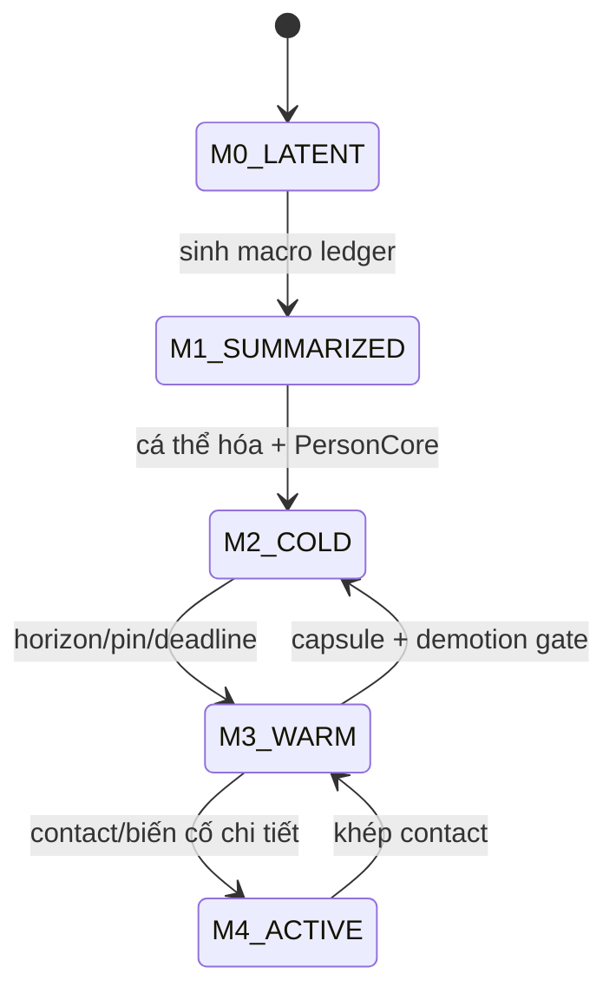

# Mô phỏng phân tầng và vòng đời thực thể quy mô lớn — K3.4

Tài liệu này cụ thể hóa R0–R4 trong [[DOI_SONG_TU_SINH_K1]], [[HOP_DONG_LAP_LICH_XU_LY_SU_KIEN_K2]], [[NGAN_SACH_HIEU_NANG_QUY_MO_K2]] và các trạng thái vùng trong [[KIEN_TRUC_DU_LIEU_NOI_DUNG_SINH_THE_GIOI_K3]]. Mục tiêu xa là vận hành 100.000+ NPC đã có danh tính mà vẫn giữ vật chất, huyết thống, nghĩa vụ, ký ức quan trọng và hậu quả nhân quả.

Đây là thiết kế logic, chưa phải thuật toán đã benchmark. 72 điều kiện PT cuối tài liệu đều chưa chạy.

## 1. Hai trục không được trộn

Mức **materialization M0–M4** nói dữ liệu nào đã tồn tại. Mức **resolution R0–R4** nói cách giải khoảng thời gian cho thực thể đã tồn tại.

Một Person M2 có thể chạy R4; một Place M4 có thể tạm chạy R2. Không được hạ R-level rồi xóa identity, hoặc materialize chi tiết rồi mặc định phải xử từng phút mãi mãi.

## 2. Mức materialization M0–M4

| Mức | Ý nghĩa | Dữ liệu |
|---|---|---|
| M0 LATENT | vùng chỉ có seed/macro constraints | chưa có cá thể |
| M1 SUMMARIZED | có ledgers dân số/tài nguyên/tổ chức | một phần dân số chưa cá thể hóa |
| M2 INDIVIDUALIZED_COLD | Person/entity đã có id | PersonCore + cold capsules + anchors |
| M3 MATERIALIZED_WARM | chi tiết cần cho tương tác sắp tới | records/relations/processes mở rộng |
| M4 ACTIVE_FULL | đang tiếp xúc/quan sát/biến cố dày | state chi tiết theo domain |

Một entity đã đạt M2 không được demote xuống M1. M1 cohort không được tuyên bố là các NPC cá thể đã sống đầy đủ.

## 3. Mức giải R0–R4

| Mức | Khoảng giải điển hình | Cách xử |
|---|---|---|
| R0 CONTACT | giây–phút game | vị trí, hành động, tiếp xúc, perception chi tiết |
| R1 LOCAL | phút–giờ | event queue chính xác, cạnh tranh tài nguyên địa phương |
| R2 PERSONAL_DAY | giờ–ngày | nhu cầu, việc, quan hệ, message theo event/ngày |
| R3 INTERVAL | ngày–tuần | interval handler, cắt tại threshold/deadline |
| R4 BATCHED_PERSON | tuần–tháng | giữ từng Person, batch routine giống nhau rồi phân kết quả xác định |

R4 không phải một con số dân số. Nó là representation và handler cho các Person M2+.

## 4. Bất biến PersonCore

Mọi Person M2+ luôn giữ:

- person id và lineage;
- sinh/tử status, tuổi và time anchors;
- body/cultivation summary đủ bảo toàn;
- household, culture/language và roles;
- current region/route position class;
- assets/title/custody/claims/obligations;
- goal/commitment anchors;
- quan hệ có hướng còn hiệu lực;
- knowledge/memory anchors;
- RNG stream cursors hoặc dẫn xuất hợp lệ;
- last resolved time, resolution plan và next boundary;
- provenance/content versions.

Không dùng bảng vùng làm nguồn thay PersonCore.

## 5. Cold capsules

Chi tiết ít dùng được đóng thành capsule theo miền:

- `BodyColdCapsule`;
- `CognitionColdCapsule`;
- `RelationshipColdCapsule`;
- `PossessionColdCapsule`;
- `ScheduleColdCapsule`;
- `HistoryColdCapsule`.

Capsule có schema/version/hash, last exact boundary, retained invariants và expansion recipe. Nó là canonical state nén, không là cache tùy ý.

## 6. Warm state

M3 mở capsule thành records/index/process cần cho horizon sắp tới. Warm-up không được tạo outcome; nó chỉ giải nén, rebuild derived index và lập event đã suy ra từ state.

M4 thêm state chi tiết cho domain đang hoạt động như Position, body nodes, perception field và ActionInstance. Kết thúc tương tác có thể quay M3/M2 sau demotion gate.

## 7. ResolutionPlan

Mỗi entity/nhóm có:

| Trường | Ý nghĩa |
|---|---|
| `current_level` | R0–R4 |
| `valid_from/to` | khoảng handler được phép |
| `retained_invariants` | đại lượng phải giữ chính xác |
| `error_budget` | sai số được phép theo miền |
| `next_boundary` | mốc buộc đánh thức |
| `promotion_triggers` | điều kiện nâng |
| `demotion_preconditions` | điều kiện hạ |
| `handler_version` | thuật toán dùng |
| `evidence_class` | phạm vi đã chứng minh |

DeviceProfile không nằm trong quyết định level.

## 8. Error budget

Sai số bằng 0 cho:

- identity/sinh/tử;
- tổng vật chất và nguồn/sink;
- title/custody/claim/obligation;
- event bắt buộc/deadline;
- lineage/huyết thống;
- message đã gửi/nhận;
- thương tích/bệnh vượt threshold;
- breakthrough/biến cố neo;
- RNG và state hash trong phạm vi parity.

Xấp xỉ chỉ dùng cho đại lượng liên tục/tập hợp đã khai, kèm bound và reconciliation.

## 9. Resolution owner

`ResolutionCoordinator` chọn plan theo state/policy và evidence, nhưng domain handler tính outcome. Coordinator không tự sửa body, tài sản hoặc belief.

Input gồm interaction horizon, deadlines, dependencies, pin reasons và handler capability. Output là plan revision + scheduled transitions; mọi thay đổi level có event/dấu vết.

## 10. Interaction horizon

Horizon là tập thực thể có thể ảnh hưởng chuỗi nhân quả tới P00 hoặc vùng active trong khoảng dự báo. Nó gồm:

- spatial reach;
- route/travel time;
- message propagation;
- hợp đồng/deadline;
- shared resource/market;
- tổ chức/quyền;
- bệnh/thời tiết/dòng vật chất;
- pursuit/conflict;
- cultivation/environment links.

Không chỉ dùng khoảng cách Euclid.

## 11. Promotion triggers

Nâng M/R trước khi:

- bước vào perception/contact range;
- giao dịch/cạnh tranh cùng asset;
- message tới người nhận;
- deadline/threshold/birth/death;
- thương tích/bệnh cần part-level;
- chiến đấu/truy đuổi;
- đột phá/tu luyện rủi ro;
- người chơi mở tương tác có quyền;
- validator/fault scenario yêu cầu;
- boundary flow cần cá thể cụ thể.

Query xem trang không tự nâng nếu projection từ cold state đã đủ.

## 12. Promotion protocol

1. freeze source summary/capsule revision;
2. xác định target M/R và reason;
3. nạp dependencies/content versions;
4. expand deterministic staging state;
5. reconcile ledgers/reservations/events;
6. validate invariants;
7. schedule overdue/next boundaries;
8. publish nguyên tử;
9. cập nhật indices/plan;
10. xuất evidence/metric.

Không xử tương tác trước khi publish promotion hợp lệ.

## 13. Promotion deadline

Mọi trigger có `must_be_ready_by_game_time`. Scheduler bắt đầu warm-up sớm theo predicted cost. Nếu không kịp, world chỉ tiến tới boundary trước tương tác và báo lag/backpressure.

Không xử bằng R4 rồi sau đó dựng ngược chi tiết R0 để khớp outcome.

## 14. Demotion preconditions

Chỉ hạ khi:

- không có active Action/Transaction/Dialogue;
- không giữ reservation/lock chưa giải;
- không có perception/contact đang mở;
- mọi deadline trong interval đã vào frontier;
- state có thể capsule hóa không mất invariant;
- references/pins đã kiểm;
- domain handler thấp hơn hỗ trợ trạng thái;
- round-trip oracle trong phạm vi evidence;
- boundary save hợp lệ.

## 15. Demotion protocol

1. khép process tới safe boundary;
2. phát mọi Fact/Observation cần thiết;
3. kết sổ asset/body/goal/relationship;
4. tạo anchors/tombstones;
5. build cold capsules và hash;
6. so retained invariants;
7. cập nhật next boundaries;
8. publish plan/capsules nguyên tử;
9. bỏ warm derived state;
10. ghi metric/evidence.

Demotion thất bại giữ mức cũ và tạo chẩn đoán.

## 16. Pin reasons

Entity không được hạ dưới mức yêu cầu khi có pin:

- PLAYER_CONTROLLED;
- OBSERVED_NOW;
- ACTIVE_COMBAT;
- ACTIVE_MEDICAL;
- ACTIVE_TRANSACTION;
- DEADLINE_NEAR;
- MESSAGE_IN_FLIGHT;
- CROSS_REGION_TRAVEL;
- DEBUG_EVIDENCE;
- MANUAL_INSPECT nếu policy cho phép;
- UNSUPPORTED_COMPACTION.

Pin có owner, scope, expiry/clear condition; pin rò rỉ phải được phát hiện.

## 17. Event horizon

Mỗi region/person giữ frontier tối thiểu gồm next scheduled event, recurrence, process threshold, deadline, message arrival, aging/birth/death risk window và boundary flow.

Interval R3/R4 phải cắt tại frontier gần nhất. Không giải thẳng một tháng qua ngày trả nợ, hết thức ăn hoặc bệnh chuyển nặng.

## 18. Wakeup index

Index theo `(game_time, boundary_kind, entity/region)` đánh thức cold entities. Đây là derived index có thể rebuild từ PersonCore/capsule/ledger.

Wakeup không polling mọi NPC mỗi tick. Cùng mốc vẫn theo canonical phase/wave/order của K2.2.

## 19. Batch key R4

Person chỉ batch khi cùng:

- handler/version;
- routine plan signature;
- region/resource context revision;
- relevant body/skill bands;
- obligations/deadline bucket không cắt interval;
- risk/exposure class;
- retained invariants/error budget;
- interval start/end.

Khác key phải tách batch. Key không dùng tên/id để tạo outcome thiên vị.

## 20. Batch execution và phân kết quả

Handler tính aggregate opportunity/resource pressure, rồi phân kết quả về từng Person bằng canonical order + per-person deterministic stream + constraints.

Mỗi Person nhận:

- state delta riêng;
- resources/source/sink refs;
- event/anchor nếu cần;
- next boundary;
- outcome provenance;
- updated hash.

Không chỉ cập nhật tổng vùng rồi để PersonCore cũ.

## 21. Batch fairness

Phân việc/thức ăn/rủi ro dựa policy, quyền, vị trí, kỹ năng và RNG hợp lệ. ID chỉ làm stable key, không ưu tiên id nhỏ. Distribution audit kiểm starvation, dominance và correlation với id/order.

NPC không được hưởng kết quả tốt vì đang gần người chơi nếu state/policy như nhau.

## 22. Cohort khác batch Person

`PopulationCohort` M1 đại diện dân số chưa cá thể hóa trong vùng summarized. `PersonBatch` R4 là cách xử nhiều Person M2+ đã có id.

Chỉ M1 cohort được split để tạo Person mới khi region materialize. Không gộp Person M2 trở lại cohort; họ chỉ có thể cold/archive nhưng vẫn giữ id.

## 23. Cohort ledger

M1 cohort giữ:

- count theo tuổi/lineage/household class;
- births/deaths/migration flows;
- occupation/skill/resource distributions;
- culture/language/organization memberships;
- body/cultivation/risk distributions;
- stocks/claims đại diện có constraints;
- anchor events;
- uncertainty/provenance;
- last/next resolved boundary.

Ledger không được chứa fractional person sau reconciliation.

## 24. Cohort-to-Person allocation

Khi cá thể hóa:

1. khóa cohort revision và quantity claims;
2. lấy seed path ổn định;
3. tạo household/person candidates;
4. phân tuổi/nghề/body/assets theo totals;
5. dựng timeline/relations hợp lệ;
6. trừ đúng cohort bins/stocks;
7. validate aggregate equality;
8. publish Person M2+ cùng ledger mới nguyên tử.

Không chọn traits để phù hợp quest hiện tại.

## 25. Identity reservation

Nếu M1 đã phát sinh tham chiếu như “trưởng đoàn chưa gặp”, hệ thống tạo `ReservedEntityAnchor` có stable id, role, constraints và provenance. Khi materialize, Person phải thỏa anchor; không tạo người khác thay thế.

Anchor không đồng nghĩa hồ sơ đầy đủ. UI chỉ biết mô tả/nguồn phù hợp.

## 26. Sinh ở vùng xa

Với Person M2+ mang thai/hộ gia đình đã cá thể hóa, birth event tạo Person id ngay cả ở R4. Có thể lưu Body/PersonCore lạnh nhưng không để cohort count thay đứa trẻ đã có cha mẹ cụ thể.

M1 cohort births chỉ tăng ledger cho tới khi cá thể hóa, trừ khi anchor/interaction yêu cầu identity.

## 27. Chết ở vùng xa

Death vượt threshold là exact event:

- Person status/tombstone;
- body/cause/time/place class;
- asset/claim/obligation succession;
- household/organization effects;
- messages/knowledge chỉ phát qua kênh;
- anchors và next events.

R4 không được giữ người sống chỉ vì chưa promote.

## 28. Tuổi và vòng đời

Age suy từ birth time, không cộng tick. Life-stage transitions là boundary events. Fertility, aging, disease và cultivation longevity handlers có version/evidence.

Tuổi thọ thay đổi không xóa death event đã commit. Người trường sinh vẫn có nhu cầu, quan hệ và lịch sử; không miễn simulation vì tuổi lớn.

## 29. Hộ và người phụ thuộc

Household là graph/ledger canonical, không chỉ tag. Batch phải giữ:

- shared stocks/quyền dùng;
- care obligations;
- residence;
- income/consumption;
- guardianship;
- inheritance;
- member presence/absence.

Person cùng hộ có thể batch chung nhưng outcome riêng và cạnh tranh tài nguyên thật.

## 30. Tài sản và bảo toàn xuyên mức

R0–R4 dùng cùng AssetRef/Transaction/Conservation. R3/R4 có thể gộp nhiều routine transfer thành batch transaction plan, nhưng receipts dẫn tới từng source/sink/owner.

Stock vùng là projection kiểm toán. Nó không được vừa là nguồn thật vừa cộng lại Person/Organization stock.

## 31. Nghĩa vụ và deadline

Mọi Contract/Obligation có frontier riêng. Batch interval bị cắt ở due time, breach window, payment/delivery và notice arrival.

Không đánh dấu hợp đồng hoàn thành từ xác suất. Outcome cần asset/action/message facts tương ứng.

## 32. Công việc và sản xuất xa

RoutinePlan nêu inputs, tools, place, skill, time, outputs, failure thresholds và market/organization context. R4 handler tích phân số nguyên, trừ inputs trước hoặc reserve đúng quy tắc.

Thiếu công cụ/nguyên liệu/người thay làm plan stale và wake decision; không dùng năng suất mặc định vô nguồn.

## 33. Cơ thể và nhu cầu xa

BodyColdCapsule giữ functional reserves, active conditions, medication/care, thresholds và next checks. Ăn/uống/ngủ/hao mòn được tích phân nhưng cắt tại cạn stock, bệnh chuyển pha hoặc tác động ngoài.

Promotion mở lại anatomy chi tiết sao cho summary khớp; không đặt ngẫu nhiên thương tích vào bộ phận để giải thích chỉ số thấp.

## 34. Bệnh dịch

Ở M1 có compartment/cohort model với exact total; ở M2+ mỗi Person giữ exposure/infection anchors cần thiết. Contact dày R0/R1 dùng network; vùng xa dùng flow đã chứng minh và materialize notable transmissions.

Khi Person di chuyển giữa vùng, infection state đi cùng họ. Boundary ledger không nhân hoặc xóa ca bệnh.

## 35. Tu luyện xa

Routine tu luyện R3/R4 tích phân nguồn vào, route efficiency, loss, strain và learning; cắt tại resource exhaustion, injury threshold, insight/bottleneck hoặc breakthrough candidate.

Breakthrough luôn là anchor và cần promote đủ mức trước quá trình rủi ro. Không roll một kết quả thành/bại duy nhất cho cả batch.

## 36. Chiến đấu và bạo lực xa

Không giải combat có cá thể đã biết bằng “mất 10% dân số”. Conflict macro có thể phân phối exposure/opportunity, nhưng encounter liên quan Person M2+ phải tạo participants, assets, cause và injury/death facts riêng.

Dense combat chưa có handler parity thì scheduler dừng/UNSUPPORTED hoặc promote theo capacity; không bịa casualties để đi tiếp.

## 37. Quan hệ xa

Relationship edge chỉ đổi qua encounter, message, obligation, observed outcome hoặc inference hợp lệ. Batch routine có thể tạo encounter candidates từ cùng place/work schedule, sau đó ghi edges/deltas riêng.

Không cộng “+1 thân thiện toàn làng” nếu không có kênh tiếp xúc/tiếng tăm.

## 38. Tin tức và message xuyên vùng

Message là entity/event có sender, carrier/channel, content, departure, route, delay, loss/interception và recipients thực. Boundary flow chuyển message; arrival đánh thức recipient cognition.

Tin vùng không tự đồng bộ. Aggregate reputation chỉ là projection từ các observation/message lineages đã phân bố.

## 39. Di cư và hành trình

Person M2+ rời region vẫn giữ id/state. Journey process giữ route segment, supplies, companions, risks và arrival frontier. Không trừ ở nguồn rồi cộng bản sao mới ở đích.

M1 cohort migration là integer flow token; nếu đoàn có anchor/leader/asset cụ thể, phải cá thể hóa trước khi đi qua vùng tương tác.

## 40. BoundaryFlow

Mọi dòng xuyên vùng dùng record:

- flow id/type;
- source/destination boundary;
- departure/arrival window;
- entity/quantity refs;
- carrier/route;
- ownership/custody;
- state/condition summary;
- source/destination revisions;
- status/idempotency;
- provenance.

Hai region không cùng sở hữu một entity vật lý tại một time.

## 41. Reconciliation biên

Tại arrival/departure:

1. kiểm token/idempotency;
2. khép source mutation;
3. chuyển custody/position state;
4. áp destination constraints;
5. xử delay/loss/diversion qua event;
6. cập nhật ledgers hai phía;
7. so conservation;
8. publish facts/messages.

Save giữa hành trình giữ flow canonical, không để entity ở cả hai vùng.

## 42. Thị trường vùng

Market summary giữ order/stock/flow distributions có nguồn từ actors/organizations. Giá là outcome theo nơi/time/thông tin, không global lookup.

Person R4 giao dịch vẫn có counterparty hoặc market mechanism có quyền rõ; asset/tiền chuyển thật. Aggregate clearing phải phân receipts về từng participant.

## 43. Tổ chức quy mô lớn

Organization giữ roles, membership, authority, treasury, obligations, decisions và branches. Chi nhánh có ledgers riêng cùng reconciliation.

Batch organizational routines không biến mọi thành viên thành một agent. Quyết định cần người/cơ quan có quyền, quorum/thông tin và message propagation.

## 44. Lịch sử và anchor retention

Retention class:

| Class | Giữ |
|---|---|
| P0 PERMANENT | sinh/tử, lineage, unique item, world change, player causal |
| P1 LEGAL | title/claim/contract/succession còn ảnh hưởng |
| P2 COGNITIVE | ký ức/niềm tin/relationship anchors còn tham chiếu |
| P3 DOMAIN | injury/cultivation/organization milestones |
| P4 COMPACTABLE | routine detail đã kết sổ và không còn ref |

Compaction tạo summary provenance; không xóa anchor chỉ vì cũ.

## 45. Reference pin graph

Entity/anchor được pin nếu save state khác tham chiếu đến qua asset, relation, memory, claim, ancestry, event, message hoặc debug evidence. Graph thưa/index reverse ref giúp kiểm trước compact.

Bloom/filter/index có thể hỗ trợ nhưng không là bằng chứng duy nhất để xóa canonical record.

## 46. Ký ức và quên ở quy mô lớn

Memory chi tiết có thể compact thành semantic summary với source lineage, confidence, time range và emotional/goal relevance. Quên làm đổi cognition state, không xóa Fact hoặc lịch sử world.

Người đã quên ai đó vẫn có thể còn legal/kinship edge; các miền giữ nguồn riêng.

## 47. Event compaction

Chỉ compact khi:

- transaction đã kết sổ;
- không recurrence/replay dependency;
- all projections/anchors cần thiết đã tạo;
- audit retention cho phép;
- summary hash/provenance có thể kiểm;
- migration policy hỗ trợ;
- oracle round-trip đạt.

Không compact event đang là bằng chứng cho claim, memory hoặc cause of death.

## 48. Query không ép world thành R0

UI query dùng projection từ M2 cold/R4 nếu đủ. Chỉ thao tác cần chi tiết mới request promotion. Danh sách 100.000 NPC phải phân trang/index, không load mọi Body/Memory graph.

Tìm kiếm vẫn theo knowledge/access. Query debug toàn tri tách quyền và không ảnh hưởng resolution plan trừ lệnh kiểm thử rõ.

## 49. View consistency

Projection ghi source revision, materialization/resolution freshness và uncertainty. Nếu một Person đang promote, UI có thể hiển thị cold summary hợp lệ kèm trạng thái cập nhật; không trộn field từ hai revision.

Mobile/desktop nhận cùng semantics dù page size/prefetch khác.

## 50. Offline và catch-up

OFFLINE_STOP giữ nguyên frontier. OFFLINE_CATCHUP chạy các boundary theo order, có thể dùng R3/R4 handlers đã chứng minh nhưng vẫn cắt tại trigger/promotion.

Catch-up dài có progress/yield/checkpoint và có thể dừng. Không nhảy thẳng thống kê cuối rồi dựng sự kiện giả.

## 51. Save partition

Logical save chia:

- global manifest/frontier;
- region shards;
- PersonCore partitions;
- cold capsules;
- boundary flows;
- anchors/tombstones;
- active warm state;
- indices có thể rebuild.

Snapshot generation khóa revision vector/manifest nhất quán. Không nhất thiết ghi lại mọi shard không đổi.

## 52. Load theo nhu cầu

Load pipeline trước hết đọc manifest, global frontier, active region và pins. Cold partitions có thể lazy-load nhưng mọi upcoming boundary cần được index trước khi world RUNNING.

Thiếu shard bắt buộc là CORRUPT/UNAVAILABLE, không coi NPC/vật đã biến mất.

## 53. Capacity envelope

Capacity không chỉ là số NPC. Profile ghi:

- M0–M4 counts;
- R0–R4 counts;
- events/frontiers per horizon;
- active flows/transactions/messages;
- body/cognition/relationship capsule sizes;
- promotion rate/latency;
- batch key fragmentation;
- pins;
- save delta growth;
- UI query workload.

100.000 R4 ổn định khác 100.000 R0 chiến đấu.

## 54. Overload behavior

Khi vượt capacity:

1. giảm horizon giải phía trước;
2. yield UI;
3. trì hoãn prefetch/generation/query phụ;
4. compact cache/index hợp lệ;
5. báo lag/backpressure;
6. checkpoint nếu an toàn;
7. STOPPED_SAFE trước deadline không thể promote.

Không đổi R-plan, bỏ Person/event hoặc tăng error budget theo sức máy.

## 55. Thrashing control

Promotion/demotion liên tục được hạn chế bằng:

- minimum residence interval;
- predicted horizon;
- hysteresis theo distance/causal risk;
- shared dependency pins;
- warm cache budget;
- measured promotion cost;
- reason priority;
- cooldown chỉ cho optimization, không chặn trigger correctness.

Trigger bắt buộc luôn thắng hysteresis.

## 56. Parallelism

Region/batch có thể tính song song nếu declared read/write sets không giao nhau. Boundary flows, shared market/organization và global anchors tạo dependency edges.

Workers xuất deterministic candidate deltas; single authority sort/validate/commit. Worker completion order không là event order.

## 57. Validator và oracle

Oracle cần kiểm:

- Person count/id permanence;
- cohort↔Person integer conservation;
- assets/claims/flows;
- R0 baseline vs R2–R4 parity trong error budget;
- promotion/demotion round-trip;
- interval split tại mọi frontier;
- order/partition/worker independence;
- save/load/catch-up parity;
- reference/anchor retention;
- no truth leak qua projection.

## 58. Workload chứng minh

| Workload | Trọng tâm |
|---|---|
| W0-RESOLUTION | 5 Person qua R0–R4 round-trip |
| W1-ANKHE | 21 Person, 30 ngày, mọi người M2+ |
| W2-TOWN | 1.000 Person, migration/market/disease |
| W3-REGION | 10.000 Person, organizations/boundary flows |
| W4-WORLD | 100.000 Person M2+, phần lớn R4, crisis promotions |

W4 chỉ được công bố khi PersonCore thật đủ 100.000 và ledgers khớp; không đếm cohort M1 như NPC cá thể.

## 59. Cổng K3.4

| Gate | Yêu cầu | Hiện tại |
|---|---|---|
| K3P01 | M0–M4 và R0–R4 tách rõ | đạt trên giấy |
| K3P02 | PersonCore/capsule/promotion/demotion rõ | đạt đặc tả |
| K3P03 | cohort/batch/boundary/retention rõ | đạt đặc tả |
| K3P04 | overload không giảm correctness | đạt nguyên tắc |
| K3P05 | schemas/handlers/index máy | chưa có |
| K3P06 | R0 baseline runner | chưa code |
| K3P07 | round-trip/parity evidence | chưa chạy |
| K3P08 | W2/W3 capacity evidence | chưa chạy |
| K3P09 | W4 100.000 Person evidence | chưa chạy |
| K3P10 | mobile/desktop save/performance parity | chưa chạy |

Gate không cộng vào PT.

## 60. Điều kiện PT01–PT18 — mức tồn tại và kế hoạch giải

| ID | Điều kiện chưa chạy |
|---|---|
| PT01 | M-level và R-level thay độc lập, không suy diễn lẫn nhau |
| PT02 | Person M2 không demote thành cohort M1 |
| PT03 | R4 vẫn giữ từng PersonCore/id |
| PT04 | PersonCore đủ sinh/tử/body/hộ/vị trí/quyền/nghĩa vụ/frontier |
| PT05 | capsule có schema/version/hash/last boundary |
| PT06 | warm-up không tạo outcome hoặc tiêu RNG gameplay |
| PT07 | DeviceProfile không tự chọn R-level |
| PT08 | plan đổi level có event/reason/revision |
| PT09 | exact invariants không nhận error budget khác 0 |
| PT10 | handler ngoài evidence class bị UNSUPPORTED |
| PT11 | interaction horizon gồm message/contract/resource, không chỉ khoảng cách |
| PT12 | query đủ từ cold state không tự promote |
| PT13 | correctness trigger thắng optimization hysteresis |
| PT14 | promotion có must_be_ready_by_game_time |
| PT15 | promotion trễ chặn world trước interaction boundary |
| PT16 | demotion có active process/reservation bị từ chối |
| PT17 | pin có owner/expiry/clear condition |
| PT18 | pin leak được metric/validator phát hiện |

## 61. Điều kiện PT19–PT36 — frontier, batch và cohort

| ID | Điều kiện chưa chạy |
|---|---|
| PT19 | interval cắt tại deadline/threshold/message/birth/death |
| PT20 | wakeup index rebuild cho cùng frontier set |
| PT21 | cùng mốc giữ phase/wave canonical |
| PT22 | batch chỉ gộp Person cùng complete BatchKey |
| PT23 | batch phân delta/provenance/next boundary về từng Person |
| PT24 | id nhỏ không nhận tài nguyên/rủi ro ưu tiên hệ thống |
| PT25 | đổi input iteration order không đổi phân batch outcome |
| PT26 | cohort M1 không được báo là Person M2 |
| PT27 | cohort ledger không có fractional person sau resolve |
| PT28 | cohort-to-Person giữ count/bins/stocks nguyên tử |
| PT29 | materialization không chọn traits theo quest hiện tại |
| PT30 | ReservedEntityAnchor giữ cùng identity khi mở hồ sơ |
| PT31 | birth của cha mẹ M2 tạo Person id dù vùng R4 |
| PT32 | death R4 cập nhật tombstone/succession đúng thời điểm |
| PT33 | age suy từ birth time, không drift do số tick |
| PT34 | batch hộ vẫn phân consumption/care về người cụ thể |
| PT35 | stock vùng không đếm kép stock Person/Organization |
| PT36 | obligation interval luôn cắt tại due/breach/notice |

## 62. Điều kiện PT37–PT54 — domain và dòng liên vùng

| ID | Điều kiện chưa chạy |
|---|---|
| PT37 | sản xuất R4 trừ/reserve input trước output |
| PT38 | hết tool/input làm RoutinePlan stale và wake decision |
| PT39 | Body capsule promote khớp functional summary, không bịa thương tích |
| PT40 | bệnh qua boundary không nhân/xóa infection state |
| PT41 | breakthrough candidate promote trước outcome rủi ro |
| PT42 | batch tu luyện không roll một kết quả chung cho mọi Person |
| PT43 | combat chưa hỗ trợ không biến thành casualty percentage |
| PT44 | relationship delta có encounter/message/obligation source |
| PT45 | reputation không broadcast Fact toàn vùng |
| PT46 | message arrival đánh thức đúng recipient cognition |
| PT47 | Person di cư giữ id/body/assets/relations |
| PT48 | flow departure/arrival không để entity ở hai region |
| PT49 | retry BoundaryFlow không nhân entity/quantity |
| PT50 | delay/loss/diversion tạo event thay vì sửa time im lặng |
| PT51 | market clearing phân receipt về từng participant |
| PT52 | organization decision có authority/information/quorum hợp lệ |
| PT53 | shared cross-region dependency tạo scheduling edge |
| PT54 | worker completion order không đổi commit order/hash |

## 63. Điều kiện PT55–PT72 — retention, save và quy mô

| ID | Điều kiện chưa chạy |
|---|---|
| PT55 | anchor retention giữ sinh/tử/lineage/world/player-causal |
| PT56 | claim/memory/ancestry ref ngăn compact record nguồn |
| PT57 | quên ký ức không xóa Fact/legal/kinship state |
| PT58 | event làm bằng chứng claim/cause không bị compact |
| PT59 | compaction summary có source range/hash/provenance |
| PT60 | query 100.000 Person không load toàn Body/Memory graph |
| PT61 | stale projection không trộn field khác revision |
| PT62 | mobile/desktop page size khác vẫn cùng semantic result |
| PT63 | OFFLINE_STOP không tiến frontier |
| PT64 | CATCHUP dùng same boundaries và có thể yield/pause |
| PT65 | save manifest khóa revision vector của shards |
| PT66 | thiếu required shard không làm entity biến mất |
| PT67 | overload giảm horizon/prefetch trước gameplay correctness |
| PT68 | máy chậm không tự hạ level/tăng error budget |
| PT69 | thrashing metric đo promotion/demotion/cost/reason |
| PT70 | R0 baseline và R2–R4 khớp retained invariants |
| PT71 | W4 chỉ đếm Person M2+, không cộng cohort M1 |
| PT72 | 100.000 Person claim cần evidence count/ledger/save/performance |

## 64. Truy vết và tổng điều kiện

| Nhóm PT | Nguồn |
|---|---|
| PT01–PT18 | K3.1 resolution architecture, HN R0–R4 |
| PT19–PT36 | scheduler frontier, K1 life course, K3.3 cohort/materialization |
| PT37–PT54 | body/cultivation/combat/economy/cognition/boundary contracts |
| PT55–PT72 | save/retention/query/performance/evidence |

72 PT nâng tổng từ 876 lên **948 điều kiện thiết kế chưa chạy**, thuộc 31 họ.

## 65. Sơ đồ chuyển mức



Không có mũi tên M2 về M1. R0–R4 là plan chạy bên trong M2–M4 và không nằm trên sơ đồ identity.

## 66. Topology dữ liệu tương lai

```text
world/
  manifest-frontier/
  regions/
    summaries/
    warm-state/
    boundary-flows/
  persons/
    core/
    cold-capsules/
  organizations/
  anchors-tombstones/
  wakeup-index/
  reverse-reference-index/
resolution/
  plans/
  handlers/
  evidence/
```

Đây là trách nhiệm logic, chưa là cấu trúc thư mục/code đã chọn.

## 67. Thứ tự hiện thực hóa khi được phép

1. PersonCore + M2 cold fixture 21 người;
2. ResolutionPlan/frontier/wakeup index;
3. R0 baseline một routine;
4. R2/R3 interval handler và split threshold;
5. R4 batch năm Person, phân delta riêng;
6. promotion/demotion round-trip;
7. BoundaryFlow hai vùng;
8. save partition/load lazy;
9. W1 21 Person 30 ngày;
10. W2 1.000 rồi W3 10.000;
11. W4 100.000 chỉ sau parity/capacity gates;
12. mở thêm domain từng handler có evidence.

## 68. Điều không được tuyên bố

- Không nói 100.000 NPC đã chạy.
- Không đếm cohort M1 như NPC cá thể.
- Không nói R4 tương đương R0 nếu chưa có parity evidence.
- Không nói hạ chi tiết không mất gì ngoài retained invariants đã công bố.
- Không nói mobile đạt W4.
- Không nói batch tạo câu chuyện riêng nếu chưa phân outcome/provenance về Person.
- Không nói promotion tức thời nếu chưa đo latency/capacity.

## 69. Giá trị K3.4 cung cấp thật

- hai trục M và R tránh xóa danh tính khi tối ưu;
- PersonCore/capsule/frontier rõ;
- protocol promotion/demotion có gate;
- batch R4 vẫn cập nhật từng người;
- cohort M1 không giả làm cá thể;
- sinh/tử/hành trình/nghĩa vụ/quan hệ xuyên mức;
- boundary flows chống nhân vật chất/người;
- retention/save/query/capacity cho thế giới lớn;
- tiêu chuẩn trung thực cho lời tuyên bố 100.000 NPC.

## 70. Vấn đề mở

- trường PersonCore máy cụ thể;
- công thức từng R-handler;
- event horizon prediction;
- retention duration theo domain;
- batch key fragmentation threshold;
- cấu trúc partition/shard vật lý;
- index/storage engine;
- W2–W4 fixture/generator;
- chuẩn thiết bị và hard capacity;
- policy offline/TN02.

## 71. Quan hệ với điện thoại và máy tính

Cùng save, M/R state và handler semantics chạy trên cả hai. Thiết bị chỉ quyết định real-time throughput, slice/prefetch/cache trong phạm vi không can thiệp. Nếu mobile không đạt workload, game phải báo capacity/lag hoặc giới hạn phạm vi được chứng nhận; không âm thầm làm NPC kém thật hơn desktop.

## 72. Bước tiếp theo

K3.5 nay đã được cụ thể hóa tại [[LUU_TRU_PHAN_VUNG_CHI_MUC_TRUY_VAN_K3]]. K3.6 đã được lập tại [[ARTIFACT_MAY_SCHEMA_REGISTRY_CONDITION_CATALOG_K3]]. K3.7 đã được kiểm toán tại [[KIEM_TOAN_DONG_GOI_K3]]. K4.1 đã được lập tại [[NEN_VAT_CHAT_NANG_LUONG_TRUONG_HIEN_TUONG_K4]]. K4.2 đã được lập tại [[CO_THE_DA_TANG_SINH_LY_BENH_LY_TU_LUYEN_K4]]. K4.3 đã được lập tại [[VAT_LIEU_VAT_PHAM_CAU_TRUC_CONG_DUNG_CHE_TAC_K4]]. K4.4 đã được lập tại [[DIA_LY_KHI_HAU_THUY_VAN_DAT_SINH_THAI_LINH_SINH_QUYEN_K4]]. K4.5 đã được lập tại [[CONG_PHAP_CANH_GIOI_LINH_CAN_KY_NANG_THUAT_PHAP_TRUYEN_THUA_K4]]. K4.6 đã được lập tại [[NPC_TU_TRI_NHU_CAU_KE_HOACH_QUAN_HE_KY_UC_CAU_CHUYEN_PHAT_SINH_K4]]. K4.7 đã được lập tại [[KINH_TE_TO_CHUC_XA_HOI_QUYEN_LUC_LUAT_PHAP_K4]]. K4.8 đã được lập tại [[CHIEN_DAU_XUNG_DOT_TRUY_DUOI_AN_NAP_DIEU_TRA_HAU_QUA_K4]]. K4.9 đã hoàn thành tại [[KIEM_TOAN_TICH_HOP_K4_PHAM_VI_BAN_DAU_VA_CHUAN_BI_LAP_TRINH]]. Kế hoạch nền đã đủ; chờ người dùng yêu cầu bắt đầu K5.1 prototype và V0.
